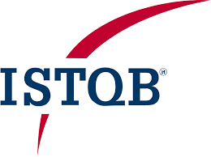

<!DOCTYPE html>
<html lang="en">
<head>
<meta charset="UTF-8">
<link rel="icon" type="image/png" href="profile.jpg">
<meta name="viewport" content="width=device-width, initial-scale=1">
<!-- Font Awesome kit (same as yours) -->

<title>Bhuwan Agrawal – Resume</title>

</head>

<body>

<!-- Header Section -->

  

    <h1 style="margin: 0 auto; font-size: 32px; color: #1a5276; font-family: 'Georgia', serif; text-align: center; flex: 1;">Curriculum Vitae</h1>
  

  

    

      <h2 style="margin-top: 0; font-size: 28px; font-family: 'Georgia', serif; color: #1a5276; text-align: left;">Bhuwan Agrawal</h2>
      <h4 style="margin-top: -10px; font-family: 'Georgia', serif; color: #1a5276; text-align: left; font-size: 14px;">
        QA Manager | Automation (Playwright, Cypress) | AI-Assisted Testing | CI/CD</h4>

      
<i class='fas fa-map-marker-alt'></i> B-105 Stellar Mi Citihomes, Omicron 3, Greater Noida, 201310

      
<i class='fas fa-mobile-alt'></i> 8800149988 | <i class='fa fa-envelope'></i> <a href="mailto:bhuwan83@gmail.com">bhuwan83@gmail.com</a>

      
<i class='fab fa-linkedin'></i> <a href="https://www.linkedin.com/in/bhuwanagrawal" target="_blank">linkedin.com/in/bhuwanagrawal</a>

      
<i class='fab fa-github'></i> <a href="https://github.com/BhuwanAgrawal" target="_blank">github.com/BhuwanAgrawal</a>

      
<a href="Resume_QA_Bhuwan_Agrawal.pdf" download style="color: inherit;"><i class='fas fa-file-download'></i> Download Resume (PDF)</a>

    

    

      

        
      

      

        
        <a href="https://www.istqb.in/about-us/certified-tester/foundation-level/36257-bhuwan-agrawal" target="_blank" style="text-decoration: none; color: #1a5276;" title="View Certification">
          
<i class="fas fa-certificate"></i> ISTQB Certified

        </a>
      

    

  

<!-- Navbar -->

  <!-- NOTE: links are normal href="#id" (JS will handle smooth scroll + hash update) -->
  <a href="#career-objective">Career Objective</a>
  <a href="#profile-summary">Profile Summary</a>
  <a href="#technical-skills">Technical Skills</a>
  <a href="#work-experience">Work Experience</a>
  <a href="#key-projects">Project Experience</a>
  <a href="#github-portfolio">GitHub Portfolio</a>
  <a href="#certifications">Certifications</a>
  <a href="#academic-background">Academic Background</a>

<!-- Sections -->

  <h2><i class="fas fa-bullseye"></i> Career Objective</h2>
  
To leverage over 13+ years of experience in software quality assurance, test automation, and AI-driven testing to architect scalable QA frameworks, mentor engineering teams, and deliver high-quality products through innovative, automation-first, and AI-powered testing strategies across UI, API, database, performance, and non-functional domains.

  <h2><i class="fas fa-user"></i> Profile Summary</h2>
  
QA Leader with 13+ years’ experience in automation and quality engineering. Skilled in building scalable QA frameworks across UI, API, DB, and performance testing. Hands-on with Cypress, Playwright, Jenkins and GitHub Actions. Proficient in AI-assisted testing using VS Code with GitHub Copilot and Cursor, driving faster script creation, improved test coverage, and higher efficiency. Strong track record in mentoring teams, defining QA strategy, and ensuring quality-first agile delivery.

  <h2><i class="fas fa-tools"></i> Technical Skills</h2>
  <ul>
    <li><strong>Testing Tools:</strong> Selenium, Cypress, Playwright</li>
    <li><strong>Languages:</strong> Java, Python, JavaScript, TypeScript</li>
    <li><strong>Test Management Tools:</strong> TestRail, TestLink</li>
    <li><strong>API Testing:</strong> Postman, Playwright</li>
    <li><strong>CI/CD Tools:</strong> Jenkins, GitHub Actions</li>
    <li><strong>Cloud Testing Platforms:</strong> Browserstack</li>
    <li><strong>AI Tools:</strong> Cursor AI, GitHub Copilot</li>
    <li><strong>Bug Tracking:</strong> JIRA</li>
    <li><strong>Version Control:</strong> SVN, GitHub</li>
    <li><strong>Database:</strong> MS SQL Server, Postgres</li>
    <li><strong>Operating Systems:</strong> Windows 10/11</li>
    <li><strong>Other:</strong> Agile Methodologies, Project Planning, Team Leadership, SDLC/STLC, Regression & Functional Testing</li>
  </ul>

  <h2><i class="fas fa-briefcase"></i> Work Experience</h2>
  <ul>
    <li><strong>QA Manager</strong> – Bitxia Tech Pvt. Ltd., Gurugram (Sep 2022 – July 2025)</li>
    <li><strong>Sr. Test Engineer</strong> – DLT LABS, Noida (Jun 2021 – Sep 2022)</li>
    <li><strong>Associate Team Lead</strong> – Xorlabs.com, Greater Noida (Mar 2014 – Jun 2021)</li>
    <li><strong>Software Test Engineer</strong> – Safenet Infotech Pvt. Ltd. via Magna InfoTech, Noida (Mar 2012 – Mar 2014)</li>
  </ul>

<!-- Project Experience (Full restored) -->

  <h2><i class="fas fa-project-diagram"></i> Project Experience</h2>

  <!-- Bitxia Tech -->
  <h3 class="company-name">Bitxia Tech Pvt. Ltd.</h3>
  <ul class="contribution-list">
    <li><strong>eNAM 2.0 (Dec 2024 – July 2025):</strong> Digital agri-trading platform enabling farmers, traders, and FPOs to buy/sell produce online. <em><strong>Contribution:</strong></em> Designed and executed automation framework using Playwright for UI and API automation, ensuring faster regression cycles and improved test coverage.</li>
    <li><strong>APL Logistics COMS Application (Apr 2023 – Dec 2024):</strong> Comprehensive logistics and supply chain management solution for order, shipment, and warehouse operations. <em><strong>Contribution:</strong></em> Implemented Playwright-based automation integrated into CI/CD pipelines, enhancing reliability and reducing manual testing effort.</li>
    <li><strong>Investor Portal (Sep 2022 – Apr 2023):</strong> Web platform for investors to manage profiles, portfolios, and track investments. <em><strong>Contribution:</strong></em> Developed Cypress automation scripts for functional and regression testing, reducing manual execution time and ensuring stability across releases.</li>
    <li><strong>Jarvis Retail Lending (Sep 2022 – Apr 2023):</strong> Loan origination and management system enabling digital onboarding, credit assessment, and loan processing. <em><strong>Contribution:</strong></em> Built automation suite using Cypress and integrated it into CI/CD pipelines; introduced AI-assisted testing practices to improve test efficiency and reduce defect leakage.</li>
  </ul>
  
Responsibilities at Bitxia:

  <ul class="responsibilities-list">
    <li>Led a QA team of 5–6 members, handling client communication, project estimation, and test delivery (manual & automation).</li>
    <li>Hands-on automation experience using Cypress and Playwright for UI and API test automation, improving coverage and reducing regression cycle time.</li>
    <li>Ownership of QA automation architecture and scalability across UI, API, database, performance, and non-functional testing.</li>
    <li>Mentored QA engineers on automation best practices, framework design, scripting, and AI-assisted testing with VS Code, GitHub Copilot, and Cursor.</li>
    <li>Integrated automation frameworks into CI/CD pipelines (Jenkins, GitHub Actions) ensuring faster release cycles and deployment reliability.</li>
    <li>Defined and implemented QA governance models, test strategy, and quality standards.</li>
    <li>Collaborated closely with developers, product managers, and DevOps to embed a quality-first approach in agile delivery.</li>
  </ul>

  <!-- DLT Labs -->
  <h3 class="company-name">DLT LABS</h3>
  <ul class="contribution-list">
    <li><strong>PPD (DL Asset Track) (Mar 2022 – Sep 2022)</strong> – Manual testing of blockchain apps, TestLink, Jira.</li>
    <li><strong>THOR (DL Asset Track) (Jun 2021 – Feb 2022)</strong> – Manual & functional testing using TestLink, Jira.</li>
  </ul>

  <!-- Xorlabs -->
  <h3 class="company-name">Xorlabs.com</h3>
  <ul class="contribution-list">
    <li><strong>Projects:</strong> SQLCM, XMF Automation, CML Configurator, SQL Secure, Uptime, ASD, One Source Configurator, MSQT</li>
    <li><em><strong>Responsibilities:</strong></em> Manual & automation testing (Ranorex, Selenium, TestComplete), Jira.</li>
  </ul>

  <!-- Safenet Infotech -->
  <h3 class="company-name">Safenet Infotech Pvt. Ltd.</h3>
  <ul class="contribution-list">
    <li><strong>Projects:</strong> Usage Reporting System, WPS Online, WPS Client</li>
    <li><em><strong>Responsibilities:</strong></em> Manual & QTP automation (VBScript), functional, GUI, DB testing, MKS.</li>
  </ul>

<!-- GitHub Portfolio -->

  <h2><i class="fab fa-github"></i> GitHub Portfolio – Test Automation Projects</h2>
  <ul class="contribution-list">
    <li class="project-name"><a href="https://github.com/BhuwanAgrawal/Playwright-Project" target="_blank">Playwright Project</a> – End-to-end automation framework demonstrating UI testing using Playwright.</li>
    <li class="project-name"><a href="https://github.com/BhuwanAgrawal/Cypress-Project" target="_blank">Cypress Project</a> – Test automation suite for functional and regression testing of web applications.</li>
    <li class="project-name"><a href="https://github.com/BhuwanAgrawal/Selenium-KD-Project" target="_blank">Selenium Keyword Driven Project</a> – Keyword-driven automation framework for regression and functional testing.</li>
  </ul>

<!-- Certifications (formatted like GitHub Portfolio) -->

  <h2><i class="fas fa-award"></i> Certifications</h2>
  <ul class="contribution-list">
    <li class="project-name">
      <a href="https://www.istqb.in/about-us/certified-tester/foundation-level/36257-bhuwan-agrawal" target="_blank">
        <!-- optional: keep ISTQB.png locally if you have it -->
        
        ISTQB Certified Tester – Foundation Level (CTFL), 2011
      </a>
    </li>
    <li class="project-name">
      <a href="https://www.linkedin.com/learning/certificates/c5bb67e1670e6ff45ff785902220bd9570768ed590b833d63fea9745d62e6f4c?trk=share_certificate" target="_blank">
        
        API Testing Foundations – LinkedIn Learning, 2025
      </a>
    </li>
    <li class="project-name">
      <a href="https://www.linkedin.com/learning/certificates/19c4590084f62e0303e9d21c0caf52f38ec7b99a0b13641bf989ef6ba410143f?trk=share_certificate" target="_blank">
        
        Postman Essential Training – LinkedIn Learning, 2025
      </a>
    </li>
  </ul>

  <h2><i class="fas fa-graduation-cap"></i> Academic Background</h2>
  <ul>
    <li>MCA – UP Technical University – 64.28%</li>
    <li>BCA – Allahabad Agriculture Institute – 7.96 CGPA</li>
  </ul>

</body>
</html>
